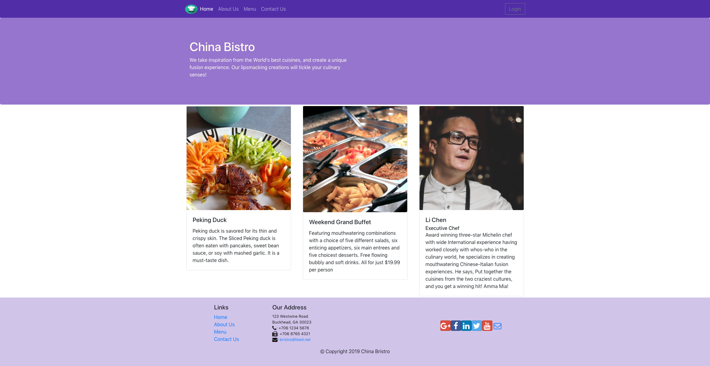

<!-- PROJECT SHIELDS -->
![Build Status][build-shield]


[![MIT License][license-shield]](license-url)
[![LinkedIn][linkedin-shield]](linkedin-url)


<br />
<p align="center">
  <h1 align="left">China Bristro</h1>
  <p align="left">
    An awesome React-Redux powered single-page web application. 
    <br />
    <a href="https://youtu.be/B0p8dqbcCp8">View Demo</a>
  </p>
</p>


<!-- TABLE OF CONTENTS -->
## Table of Contents

* [About the Project](#about-the-project)
  * [Built With](#built-with)
* [Getting Started](#getting-started)
  * [Prerequisites](#prerequisites)
  * [Installation](#installation)
* [License](#license)
* [Link](#link)


<!-- ABOUT THE PROJECT -->
## About The Project



Welcome to China Bistro. This is a React-Redux powered single-page web applcaiton. I leveraged Reactstrap for Bootstrap 4-based responsive UI design, and various aspects of React components for page layout. I used React router for page navigation, and the Flux architecture and Redux for state management. Fetch library and RESTs API were implemented for client-server communication.

### Built With
* [React](https://reactjs.org/)
* [Redux](https://redux.js.org/)
* [ReactStrap](https://reactstrap.github.io/)


<!-- GETTING STARTED -->
## Getting Started

1. **Install the React and Redux**

   ```sh
   yarn global add create-react-app
   ```
   ```sh
   yarn add redux
   ```

2. **Install dependencies**

   ```sh
   yarn install
   ```

3. **Start the development server**

   ```sh
   yarn start
   ```

## Building and Running for Production

In addition to the development server started with `yarn start`, you can also generate a full static production build and deploy that to an json-server to preview the site as it will appear once deployed:

```sh
yarn build
```

<!-- LICENSE -->
## License

Distributed under the MIT License. See `LICENSE` for more information.


<!-- CONTACT -->
## Link

Project Repo - [Github](https://github.com/chen1649chenli/china_bistro)

Website: [Link](http://www.chinabristro.com:4000)


<!-- MARKDOWN LINKS & IMAGES -->
[build-shield]: https://img.shields.io/badge/build-passing-brightgreen.svg?style=flat-square
[contributors-shield]: https://img.shields.io/badge/contributors-1-orange.svg?style=flat-square
[license-shield]: https://img.shields.io/badge/license-MIT-blue.svg?style=flat-square
[license-url]: https://choosealicense.com/licenses/mit
[linkedin-shield]: https://img.shields.io/badge/-LinkedIn-black.svg?style=flat-square&logo=linkedin&colorB=555
[linkedin-url]: https://www.linkedin.com/in/lichen1649/
[product-screenshot]: https://raw.githubusercontent.com/othneildrew/Best-README-Template/master/screenshot.png